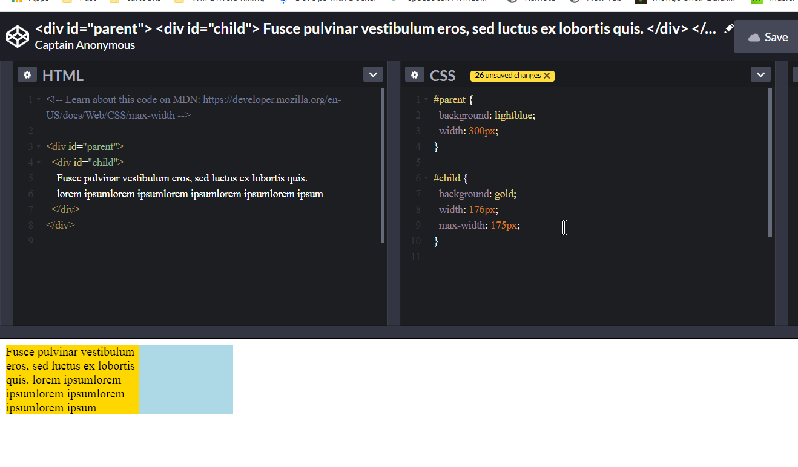
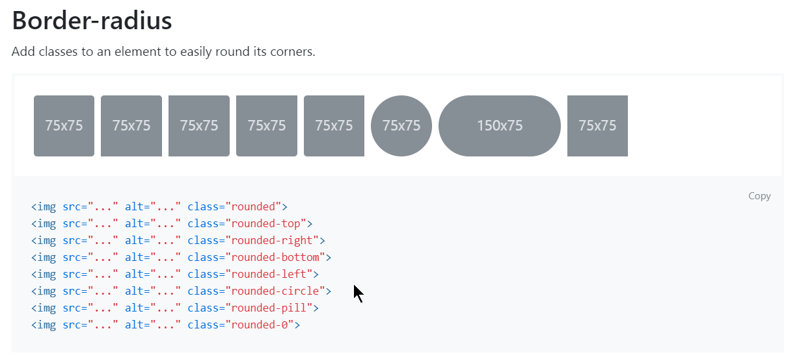
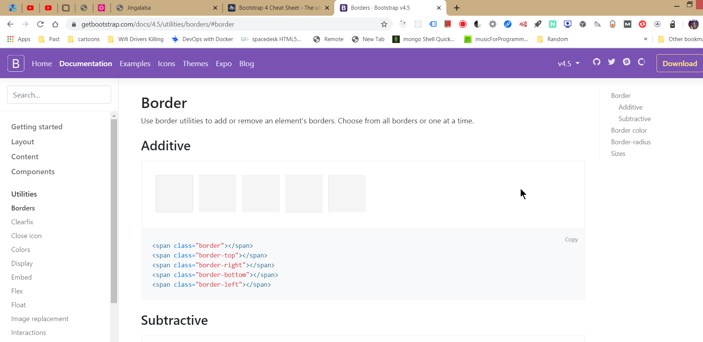
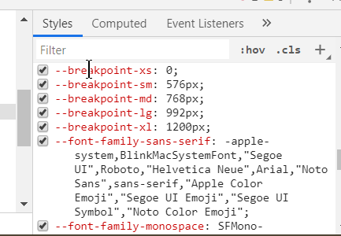

***

## html property:- width vs max-width

[Link@MDN Everything you need to know.](https://developer.mozilla.org/en-US/docs/Web/CSS/max-width)



***

### Redmi Note 5: 352px.

***

## Typography

Want different sizes of text: refer link @ [bootstrap.com](https://getbootstrap.com/docs/4.0/content/typography/)

***

## Amazing flexbox usage:

[Link@bootstrap.com](https://getbootstrap.com/docs/4.0/utilities/flex/); 
There are thousands of options for flex-box, you must look at the link. For general tasks.

```html
<div class="d-flex flex-row">
      <div class="d-flex justify-content-center">
        
        
        
      </div>
</div>
```


***

## Cards

Refer an awesome guide:- [link@w3schools](https://www.w3schools.com/bootstrap4/bootstrap_cards.asp).
use this try it @ [w3schools.com](https://www.w3schools.com/bootstrap4/tryit.asp?filename=trybs_card_link&stacked=h)
**Good thing**: For any image you want to use in card layout, just use the class card-img-top in the img tag and the image will fit magically. 
**FYI**:- **card-img-top** class just sets the image width to 100%, i.e. style="width:100%" or you may simply use the tag m-100 to set the width to 100%. This acually resizes the image to the width according to the device width, or incomparison to the device width.(i.e., w-75,w-50,w-25,)

***

text-white => sets the text color to white.

***

 <kbd>ctrl + p</kbd>

```html
 <kbd>ctrl + p</kbd>
```


***

### Border

#there is no option for thick borders, no option for 

```html
<span class="border">This will have border.</span>
<span class="border-0">This will have no border</span>
For colors
<span class="border border-primary"></span>
<span class="border border-secondary"></span>
<span class="border border-success"></span>
<span class="border border-danger"></span>
<span class="border border-warning"></span>
<span class="border border-info"></span>
<span class="border border-light"></span>
<span class="border border-dark"></span>
<span class="border border-white"></span>
```

### Border Radius



***

## Bootstrap 4 Default Settings

Bootstrap 4 uses a default `font-size` of 16px(i.e., 1rem bcoz 16px = 1rem),
 and its `line-height` is 1.5.

The default `font-family` is "Helvetica Neue", Helvetica, Arial, sans-serif.

In addition, all `` elements have `margin-top: 0` and `margin-bottom: 1rem` (16px by default).

source: link@[w3schools](https://www.w3schools.com/bootstrap4/bootstrap_typography.asp)

***


# h1 Bootstrap heading (2.5rem = 40px)

## h2 Bootstrap heading (2rem = 32px)

### h3 Bootstrap heading (1.75rem = 28px)

#### h4 Bootstrap heading (1.5rem = 24px)

##### h5 Bootstrap heading (1.25rem = 20px)

###### h6 Bootstrap heading (1rem = 16px)

Source: link@[w3schools](https://www.w3schools.com/bootstrap4/bootstrap_typography.asp)

***

## Text-transform:

[link](https://getbootstrap.com/docs/4.5/utilities/text/#text-transform)'

```html
Output:
lowercased text.

UPPERCASED TEXT.

CapiTaliZed Text.

__
<p class="text-lowercase">Lowercased text.</p>
<p class="text-uppercase">Uppercased text.</p>
<p class="text-capitalize">CapiTaliZed text.</p>
Note how .text-capitalize only changes the first letter of each word, leaving the case of any other letters unaffected.
```


***

## Browser bootstrap website correct way, from the **right minimap**, and the **left layout** 



### Text decoration

```html
<a href="#" class="text-decoration-none">Non-underlined link</a>
#Happy links
```


***

## Font weight and italics @ Bootstrap(same title)

@[link](https://getbootstrap.com/docs/4.5/utilities/text/#font-weight-and-italics)

bold and bolder look same on both desktop and mobile.
light, and lighter look same on desktop, but vary significantly on mobile device. i.e.


```html
<p class="font-weight-bold">Bold text.</p>
<p class="font-weight-bolder">Bolder weight text (relative to the parent element).</p>
<p class="font-weight-normal">Normal weight text.</p>
<p class="font-weight-light">Light weight text.</p>
<p class="font-weight-lighter">Lighter weight text (relative to the parent element).</p>
<p class="font-italic">Italic text.</p>
These classes work fine.
```

***

### Display as inline block element

Below class name sets the div to inline block element.
In css the property looks like **`display: inline-block`**

```
d-inline-block
```

***

## Emmet Cheatsheet:

[link](https://docs.emmet.io/cheat-sheet/)

## Bootstrap Cheatsheet:

[link](https://hackerthemes.com/bootstrap-cheatsheet/#col-xl-1) , Tip: You can navigate through items via Right and Left arrow. [Godlike help LOL.]

[link2](https://www.creative-tim.com/cheatsheet/bootstrap4)

[link3](http://nrpc.gov.in/wp-content/uploads/2017/10/b4-cheat-sheet-11v400-beta1-bc.pdf)

[link4](https://www.w3schools.com/bootstrap/bootstrap_ref_all_classes.asp) - w3schoolcss frameworks - https://github.com/troxler/awesome-css-frameworks 

Some Of The Most Popular CSS Libraries That Are On Github: https://www.designyourway.net/drb/the-most-popular-css-libraries-that-are-on-github/

****

## Download Bootstrap Icons repo:

View the bootstrap icons @ [link](https://icons.getbootstrap.com/) , Want to dowload all icons, get this [repo](https://github.com/twbs/icons) cloned.
• You can directly install via npm too, i.e., `npm install bootstrap-icons`. And you can view the icons directly in node_modules/bootstrap-icons/icons folder and import them from there directly.

Usage: 

```css
//Embed the icon:
<svg class="bi bi-chevron-right" width="32" height="32" viewBox="0 0 20 20" fill="currentColor" xmlns="http://www.w3.org/2000/svg"><path fill-rule="evenodd" d="M6.646 3.646a.5.5 0 01.708 0l6 6a.5.5 0 010 .708l-6 6a.5.5 0 01-.708-.708L12.293 10 6.646 4.354a.5.5 0 010-.708z" clip-rule="evenodd"/></svg>
```

```css
//Or you can link to extenal image from the download repo from the github, or directly from the node_modules/bootstrap-icons/icons folder.

```

***

## From w3school 

## What is The Viewport?

The viewport is the user's visible area of a web page.

The viewport varies with the device, and will be smaller on a mobile phone than on a computer screen.

Before tablets and mobile phones, web pages were designed only for computer screens, and it was common for web pages to have a static design and a fixed size.

Then, when we started surfing the internet using tablets and mobile phones, fixed size web pages were too large to fit the viewport. To fix this, browsers on those devices scaled down the entire web page to fit the screen.

This was not perfect!! But a quick fix.

*

### Setting The Viewport

HTML5 introduced a method to let web designers take control over the viewport, through the <meta> tag.

You should include the following <meta> viewport element in all your web pages:

<meta name="viewport" content="width=device-width, initial-scale=1.0">

**viewport** element gives the browser instructions on how to control the page's dimensions and scaling.


The **width=device-width** part sets the width of the page to follow the screen-width of the device (which will vary depending on the device).

The **initial-scale=1.0** part sets the initial zoom level when the page is first loaded by the browser.

***

## Embed youtube video (with responsiveness)

```html
<div class="embed-responsive embed-responsive-16by9">
  <iframe class="embed-responsive-item" src="//www.youtube.com/embed/48OJbbI0DfE" allowfullscreen=""></iframe>
</div>
```

src: https://hackerthemes.com/bootstrap-cheatsheet/#embed-responsive

***

## Simply setting marging with class

[help link](https://hackerthemes.com/bootstrap-cheatsheet/#p-1)

```
m-VALUE
mt-VALUE
mr-VALUE
mb-VALUE
ml-VALUE
mx-VALUE
my-VALUE 
mx-VALUE
* VALUE COULD BE :- 0,1,2,3,4,5.
```

Above mentioned are the **class names**, **m** sets for **all edges**, **mt** sets for **top** edge, **mr** sets for **right** edge, **mb** sets for **bottom** edge, **ml** sets for **left** edge, **mx** sets for **both right and left** and **my** sets for both **top and bottom**. 

***

## Responsive breakpoints @ bootstrap

[original link](https://getbootstrap.com/docs/4.0/layout/overview/#responsive-breakpoints)

Since Bootstrap is developed to be mobile first, we use a handful of [media queries](https://developer.mozilla.org/en-US/docs/Web/CSS/Media_Queries/Using_media_queries) to create sensible breakpoints for our layouts and interfaces. These breakpoints are mostly based on minimum viewport widths and allow us to scale up elements as the viewport changes.

Bootstrap primarily uses the following media query ranges—or breakpoints—in our source Sass files for our layout, grid system, and components.

**@media (min-width: 576px) { ... } => THIS SAYS, THAT MARGINS/PADDINGS/ETC WILL ONLY APPLY WHEN VIEWPORT IS 576PX IN width or maximum.**

```js
function getWidth() {
  return ({
    a:document.body.scrollWidth,
    b:document.documentElement.scrollWidth,
    c:document.body.offsetWidth,
    d:document.documentElement.offsetWidth,
    e:document.documentElement.clientWidth
  });
}
getWidth()
*
Executing we get:-
{a: 1519, b: 1519, c: 1519, d: 1519, e: 1519} in chrome desktop browser.
{a: 360, b: 368, c: 344, d: 360, e: 360} in mobile chrome browser. [REAL THAT WORKS => 352px]
```


- My laptop's width: **1536px**
  [**When calclulated with custom function(code can be found in same file), we get - 1519px**]

- My phone's width: [**REAL THAT WORKS => 352px**] **360px** (#Redmi note 5, #Redmi note5) (sm/md/lg/xl margins/padding/etc will not work straightaway.)

  [**When calclulated with custom function(code can be found in same file), we get - 368px**]
  (google - "check my browsers resolution", open any of the 1st,2nd,3rd site to get the width and height.)

```
// Extra small devices (portrait phones, less than 576px)
// No media query since this is the default in Bootstrap

// Small devices (landscape phones, 576px and up)
@media (min-width: 576px) { ... } => THIS SAYS, THAT MARGINS/PADDINGS/ETC WILL ONLY APPLY WHEN VIEWPORT IS 576PX IN width or maximum.

// Medium devices (tablets, 768px and up)
@media (min-width: 768px) { ... }

// Large devices (desktops, 992px and up)
@media (min-width: 992px) { ... }

// Extra large devices (large desktops, 1200px and up)
@media (min-width: 1200px) { ... }
```

Also, you can alter all those values in bootstrap(you need to figure it out atleast how @ bootstrap website), i.e., 


***

### Padding and responsiveness with padding:

[link](https://hackerthemes.com/bootstrap-cheatsheet/#p-1)

Note: p5=> 3rem, p4=> 1.5rem, p3=> 1rem, p2=> 0.5rem, p1=> 0.25rem
Same is for margins, i.e. m-5, m-4.. till m-1.

```html
<div class="p-0 bg-primary d-inline-block">Padded Div</div>
<div class="p-1 bg-primary d-inline-block">Padded Div</div>
<div class="p-2 bg-primary d-inline-block">Padded Div</div>
<div class="p-3 bg-primary d-inline-block">Padded Div</div>
<div class="p-4 bg-primary d-inline-block">Padded Div</div>
<div class="p-5 bg-primary d-inline-block">Padded Div</div>

<!-- respsonsive viariations -->
<div class="p-sm-5 d-inline-block bg-primary">Padded Div</div>
<div class="p-md-5 d-inline-block bg-primary">Padded Div</div>
<div class="p-lg-5 d-inline-block bg-primary">Padded Div</div>
<div class="p-xl-5 d-inline-block bg-primary">Padded Div</div>
```

*

```html
<div class="pt-0 bg-primary d-inline-block">Padded Div</div>
<div class="pt-1 bg-primary d-inline-block">Padded Div</div>
<div class="pt-2 bg-primary d-inline-block">Padded Div</div>
<div class="pt-3 bg-primary d-inline-block">Padded Div</div>
<div class="pt-4 bg-primary d-inline-block">Padded Div</div>
<div class="pt-5 bg-primary d-inline-block">Padded Div</div>

<!-- respsonsive viariations -->
<div class="pt-sm-5 d-inline-block bg-primary">Padded Div</div>
<div class="pt-md-5 d-inline-block bg-primary">Padded Div</div>
<div class="pt-lg-5 d-inline-block bg-primary">Padded Div</div>
<div class="pt-xl-5 d-inline-block bg-primary">Padded Div</div>

```

Above padding are set for padding top, similarly you can set it for r,b,l,x,y for right, bottom, left, right+left, top+bottom respectively. You can view examples @ [link](https://hackerthemes.com/bootstrap-cheatsheet/#pt-1). All those with responsiveness too.

***

### HTML5 doctype

Bootstrap requires the use of the HTML5 doctype. Without it, you’ll see some funky incomplete styling, but including it shouldn’t cause any considerable hiccups. source - bootstrap([link](https://getbootstrap.com/docs/4.5/getting-started/introduction/))

```
<!doctype html>
<html lang="en">
  ...
</html>
```

***

## Bold, Italics, Underline with Bootstrap:

@ bootstrap @ [link](https://getbootstrap.com/docs/4.5/utilities/text/)

#### Text alignment: Classes:- text-center, text-right, text-left, text-justify.

**Makes text bold:- font-weight-bold**

```
<p class="text-left">Left aligned text on all viewport sizes.</p>
<p class="text-center">Center aligned text on all viewport sizes.</p>
<p class="text-right">Right aligned text on all viewport sizes.</p>

<p class="text-sm-left">Left aligned text on viewports sized SM (small) or wider.</p>
<p class="text-md-left">Left aligned text on viewports sized MD (medium) or wider.</p>
<p class="text-lg-left">Left aligned text on viewports sized LG (large) or wider.</p>
<p class="text-xl-left">Left aligned text on viewports sized XL (extra-large) or wider.</p>

```

***

### Text wrapping and overflow

@ bootstrap @ [link](https://getbootstrap.com/docs/4.5/utilities/text/#text-wrapping-and-overflow)

```
<div class="badge badge-primary text-wrap" style="width: 6rem;">
  This text should wrap.
</div>
```


***

## Learn about Container 

#### @ bootstrap @ [link](https://getbootstrap.com/docs/4.5/layout/overview/) 

***

