***

# The best way to deal with eslint error while starting react-server is to just use below variable to disable the eslint version checking simply-

```bash
SKIP_PREFLIGHT_CHECK=true
```

There would be errors other than this, if there are you just need to fix it in the files or the eslintrc file.

***

temp--


***

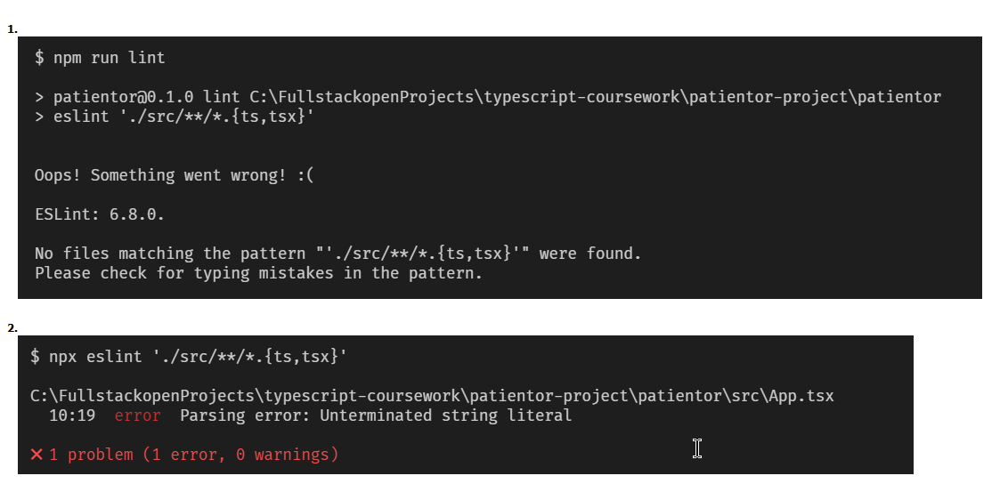

Solution:-

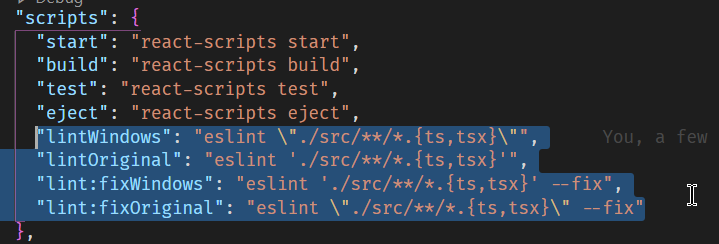


***

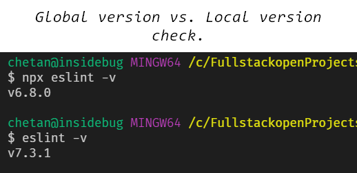

***

The symlink is created with the mklink for node_modules folder, but the problem with symlink of node_modules folder for the need of globalspace2 for eslint 6.8.0, is that when you do a npm i <any-package> or just do npm i in any folder, the  the node_modules symlink is overwritten by creating a new folder of node_modules by npm automatically. So, we need to make installs only in the eslint-6.8.0 project folder and never run any npm i related commands from anywhere where we liked it as symlink. Also, the same npm i related commands will result in crashing the configuration of the original globalspace2's config(the eslint 6.8.0 project).[if so, get the backup there.☺]

***

## Creating symlinks in windows

```bash
$ mklink /d LinkName folderName
$ mklink /d myLink ..\someFolder # This createsa link named myLink to someFolder in its parent folder.

#Note: symlinks(symbolic links) can only be created with admin cmd. Tip: Use=> ALT F,M,A
#Symlinks created could be moved/copied anywhere  but they would just WON'T work.
```


***

## Opens link for funding for the desired package.


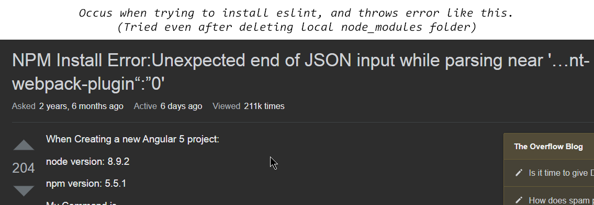

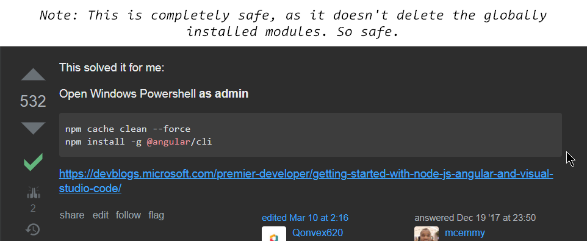


***


## Dealing with react-scripts version of eslint

We're dealing bcoz, when we run npm start, it gives error with eslint config, says to do SKIP_PREFLIGHT_CHECK=true  in env to avoid it. 

So, you might try to do-

```
npm link react-scripts
```

to get the eslint under it to be discovered by the current node project but it would not detect it. So, the last change is to try to install a separate version of eslint in local project with `npm i eslint@6.8.0` and when you try to do that it gives error. And it can be fixed via `npm cache clean --force` [The screenshot is somewhere up on this page to verify it.] So, the next option is to install react-scripts in local project, via `npm i react-scripts@requiredversion`. 


### New swithing tabs in panel(newly created- #my shortcuts)


## Use: Ctrl + Alt+ J to join a collaboration session link  via vs live share

Also, 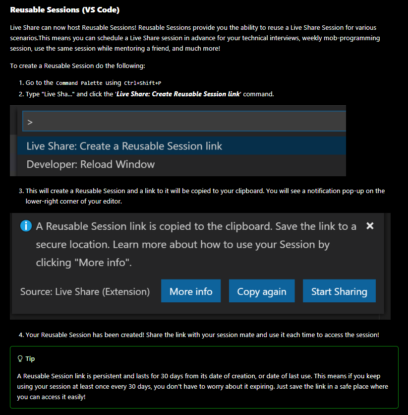

***

## This is  great to work with source code mode too, as it allows to get rid of image context menu(copy image to, upload image, zoom image in typora) when we press enter. use ctrl+/

***


***

## Promblem with graphql in global node_modules (npm list -g was throwing error actually, hence fixed with this)

src: [link](https://github.com/graphql/graphql-js/issues/1531)

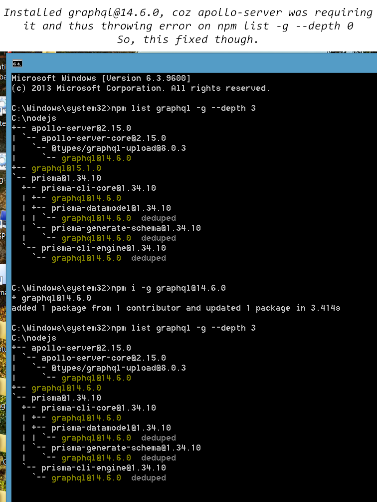

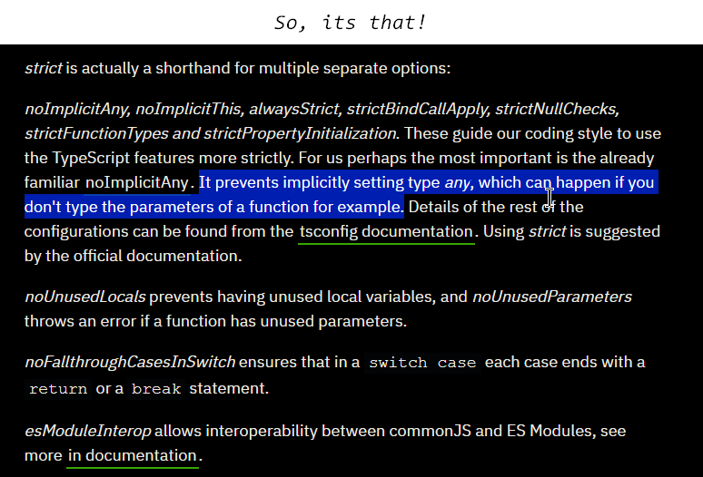

***

## Find the age of windows os

```bash
CMD
$ systeminfo|find /i "original" 
Output:
Original Install Date:     25-Jun-18, 6:35:21 AM

_
POWERSHELL
$ $os = get-wmiobject win32_operatingsystem
$ $os.ConvertToDateTime($os.InstallDate) -f "MM/dd/yyyy" 
```

So, I lost some work, and now I need to coverup.

```bash
$ tsc --init
#This will create the tsconfig.json file
```

[Example file created with the above command here@gist](https://gist.github.com/f525e712f01352bdfa405242eaac7b75)

***


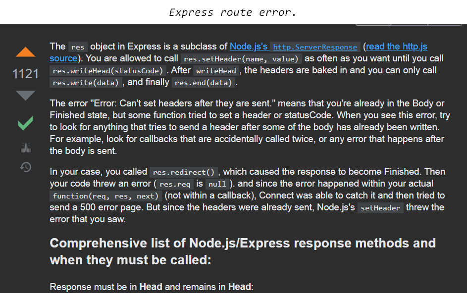

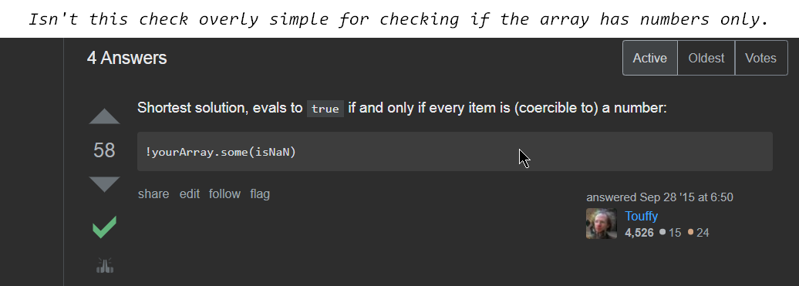


***

## What do you need to//

To be able to save to local package.json file on the command npm link <pkg-name> but this isn't facilitated, but there [npm-link-save@npm](https://www.npmjs.com/package/npm-link-save) , [github](https://github.com/laggingreflex/npm-link-save#readme) **Usage**-

nls is amazing when creating your own projects, but when you are using someone's project you must use ==npm link <pkg-name> <pkg-name2>[<pkg-names>]== as using npm link won't mutate(edit) your package.json file locally. While nls would actually replace the version of the of local dependecy version with global dependency version nubmer.

```bash
$ nls expres // single links
$ nls express morgan // multiple links
$ nls -D express     // links in devDependencies // -D is used in npm i -D <pkg-name> (for saving as dev dependency, same pattern is followed here)
```

*

## Reload Extension for vscode

You do not need this extension for anything. Not for even typescript types definitions(npm link or npm install), vscode is just too much smart to detect dependencies in your node_modules folder. But BEWARE, that you use complete package name to link to the repository, otherwise vscode won't pick the type definitions from the dependencies in the @types folder. 

*

## Link complete local node_modules folder to global node_modules insttead of linking individual dependencies-

```
$ npm link
This is just amazing, it links your local node_modules folder to the global node_modules folder, and doesn't consume
```


```bash
$ npm link @typescript-eslint/eslint-plugin @typescript-eslint/parser express @types/node @types/express
```

```bash
#Note: npm unlink will remove the package from the local package.json file.
(Destructive command, but doesn\'t alter anything in global node_modules folder)
$ npm unlink @typescript-eslint/eslint-plugin @typescript-eslint/parser express @types/node @types/express
#This command just reverses the command in the above snippet. (Won't cause any sideeffect in global packages)
```

```bash
# IMPORTANT: YOU NEED TO USE --no-save switch to be able to let package.json retain the package name after the unlink command finishes:-
npm unlink --no-save @typescript-eslint/eslint-plugin @typescript-eslint/parser express @types/node @types/express
```

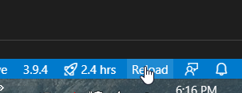

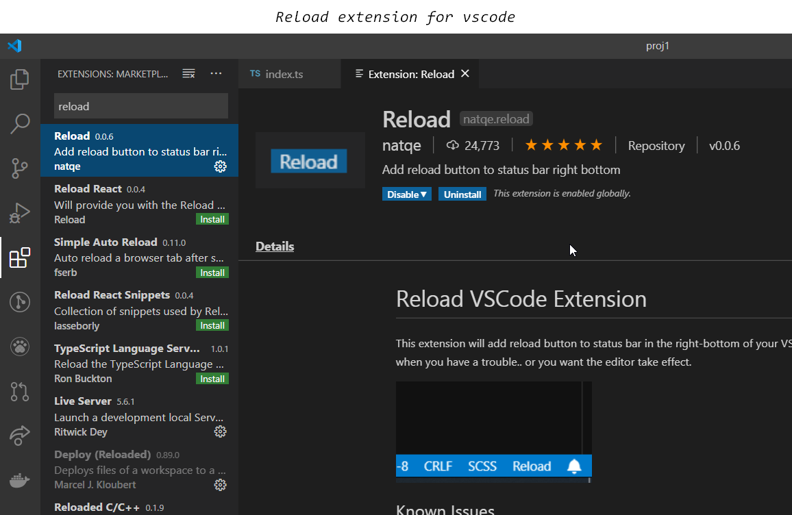

***

## Some interesting casts-


*

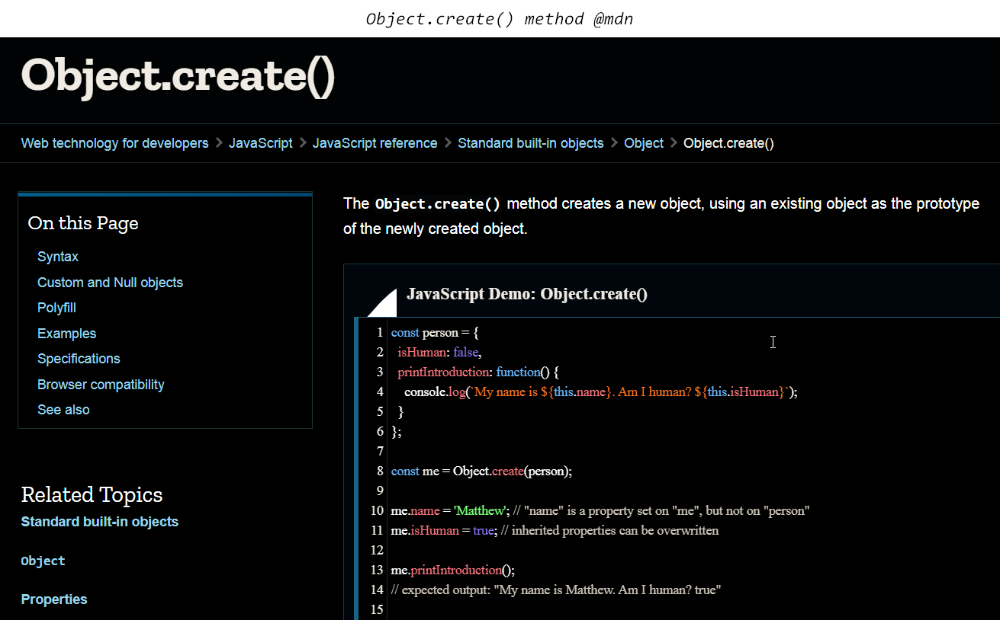


## Send formatted json with express-

Note: you need to refresh with Ctrl+shift+f5 for once to view the updated formatting of the json, otherwise it'll fetch the old formatting from the cache when you use simple refresh. [link](https://stackoverflow.com/questions/32679505/node-and-express-send-json-formatted)


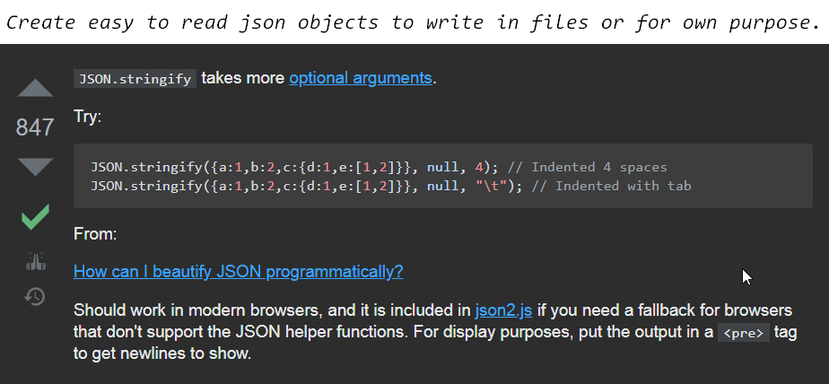


***

src: [link from kalle Ilves](https://github.com/fullstack-hy2020/create-app)


***

## npm install

```bash
$ npm i --only prod
# This will check if there is any production dependency that  
$ npm i --only dev 
```


***

## Global packages under the hood

[link](https://medium.com/@alberto.schiabel/npm-tricks-part-1-get-list-of-globally-installed-packages-39a240347ef0)

```bash
$ npm list -g --depth 0
$ npm ls -g --depth 0
$ npm list -g --depth=0 (this and above commands are same)
//Get the list of dependencies with their appropriate versions installed.
//This will show you any dependent for the current dependencies that you need to install(which might be disturbing dependency tree in global node_modules).
```

```bash
$ npm list # npm ls (is also an alias)
aliases: ls, list, la, ll
#This will list for local packages.
```

OUTPUTS:-

```bash
#Output
+-- @types/express@4.17.6
+-- @types/node@14.0.13
+-- @typescript-eslint/eslint-plugin@3.3.0
+-- @typescript-eslint/parser@3.3.0
+-- elasticdump@6.31.4
+-- eslint@7.2.0
+-- express@4.17.1
+-- jest@24.9.0
+-- live-server@1.2.1
+-- markdown-styles@3.1.10
+-- nodemon@2.0.4
+-- npm@6.14.4
+-- npm-bundle@3.0.3
+-- prisma@1.34.10
+-- react@16.13.1
+-- react-dom@16.3.1
+-- react-scripts@3.4.1
+-- ts-node@8.10.2
+-- ts-node-dev@1.0.0-pre.49
`-- typescript@3.9.5
```

***

## Updating, upgrading, up npm package-

```bash
$ npm update [-g] [<pkg>...]
#-g is for global config
aliases: up, upgrade
```


***

## npm-uninstall

aliases: remove, rm, r, un, unlink

```BASH
$ npm uninstall sax
```

*

```bash
$ npm prune 
#This command will uninstall all the packages that are listed in node_modules folder  which are not present in the package.json file.
```


***

## Listing indivicual package via `npm list`

```bash
$ npm link react
$ npm link react react-dom 
#This works too.
# NOTE: You must have the dependency as globally installed for what you are creating the symlink. npm links are just awesome, when you do
$ npm install 
# will NOT uninstall any symlinks you have created(You must have it in package.json file). So, you can just use symlinks with easy anytime.
```

***

## npm list, npm ls

```bash
$ npm ls --only prod
$ npm ls --only dev
*
$ npm ls --only=prod
$ npm ls --only=dev
***
$ npm install --only prod
$ npm install --only=prod
```


*


***


***

## ts-node for development

```bash
$ npm i -g ts-node-dev
```

***

## To install support for typescript

```bash
$ npm i -g ts-node typescript
#You should install them globally only as you just the executables over the commandline.
#Both are required to be used via cmd line with commands like, 
$ ts-node <file-name>
$ tsc <file-name>
*
When using apps created by create-react-app, it reqires you to have it installed locally, so it will not allow to start the app, unless you install in locally. BETTER THING is to just link it with global one-
npm link typescript
THAT WORKS LIKE CHARM!!
```

*npm install --save-dev @types/react @types/express @types/lodash @types/jest @types/mongoose* and so on and so on. The *@types/** are maintained by [Definitely typed](http://definitelytyped.org/), a community project with the goal to maintaining types of everything in one place.

## Typescript hero extension-

For Visual Studio Code you need the [typescript hero](https://marketplace.visualstudio.com/items?itemName=rbbit.typescript-hero) extension.

***

## To install types support for node internal modules

```bash
$ npm i --save-dev @types/node
#This has to installed as local dependency, installing globally doesn't work.

__
For using global packages via npm link
$ npm i -g @types/node
#For the use of gloablly installed modules you need to create a symlink(known as shortcut in windows) to the global module. You can easily do this with below command -
$ npm link @types/node

__
You should use
$ npm link @types
bcoz this will link the complete @types folder from global directory(c:/nodejs/node_modules/@types/), notice that this commmand give error, you just need to ignore that. That error is just redundant.
```

The *@types/** are maintained by [Definitely typed](http://definitelytyped.org/), a community project with the goal to maintaining types of everything in one place.

***

## eslint

**==You may disable prettier now onwards==**

what to do, install globally or locally or both? [link](https://github.com/microsoft/vscode-eslint/issues/13) [](https://github.com/eslint/eslint/issues/6732)

**==My new anwser: Install globally, and use it everywhere. And when react says you have another version, silent it with pref_light_check=true (check the variable name from the same error :D). And thats it. Use newer version always. Thats stable, thats why they have released it.☺==**

The simple answer is, local one can only be accessd by specifying a script in package.json for that, and running the command like: ==npm run lint== or like using from the local executable with=>  ==node_modules/.bin/nodemon index.js== or you could you ==npx eslint== too for using the locally installed version.

=="lint": "eslint --ext .ts ."== , Globally installed version of eslint is good engough. But you must check that the project is compartible with that, via looking the version of eslint used to make the eslintrc.json at the time of the project initiated. Otherwise its just fine. Coz ^ in front of version number says, that a newer patch or newer minor version (the second of the 3 set version number) of eslint would be supported. The problem arises when you want to access a different version, so when it is the case, you must install a local that version of the eslint(that's automatically done with npm install though). Even if you haven't installed eslint locally, it would still work with npm run lint command bcoz, npm will fetch from the global dependecy automatically.(FYI: vesioning semantic of npm: major no., minor no., patch no.)

```bash
npm i -g eslint
npm i -g @typescript-eslint/parser
#eslint can be used via-
$ eslint .
#But you need to initialize the current repository with a eslint(or you must have eslintrc file in the folder)
$ eslint --init
#Add a script entry in the package.json like-
"lint": "eslint ."
```

Eslint runtime vscode extension- https://marketplace.visualstudio.com/items?itemName=dbaeumer.vscode-eslint

### Answering questions on eslint --init


***

## Excluding folders from eslint


## Semicolons settings-


**Disabling no-console** 

***

## Assigning Ctrl+k Ctrl+F to closing folder/workspace


***

## Cloning to a desired name folder


***

## Using cdn for react and other useful resource


***

## End of line characters in vscode

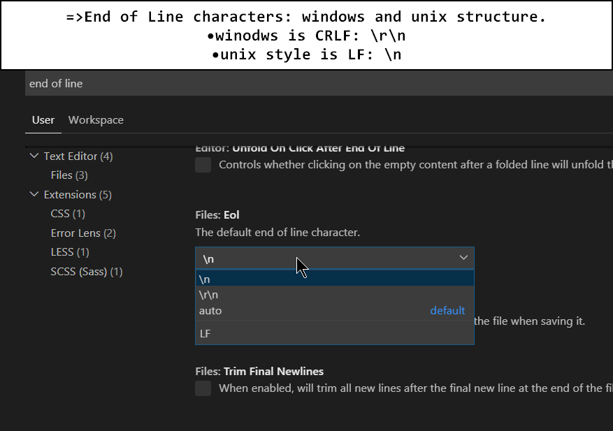

***

## argv array in node


***

## Autocomplete in ts


***

## Amazing format on paste option(Do this now..)


***

## Knowing default formatters in vscode


***

## is methods in javascript for checking type-


***

## Two ways to define type for arrray type in typescript


***

Debugging easy-


***

