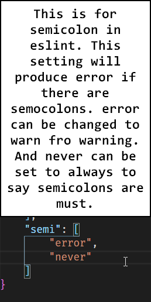
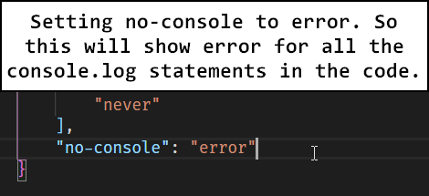
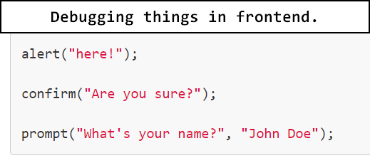

So, I lost some work, and now I need to coverup.

## Global packages under the hood

[link](https://medium.com/@alberto.schiabel/npm-tricks-part-1-get-list-of-globally-installed-packages-39a240347ef0)

```bash
$ npm list -g --depth 0
$ npm ls -g --depth 0
$ npm list -g --depth=0 (this and above commands are same)
//Get the list of dependencies with their appropriate versions installed.
//This will show you any dependent for the current dependencies that you need to install(which might be disturbing dependency tree in global node_modules).
```

```bash
$ npm list # npm ls (is also an alias)
aliases: ls, list, la, ll
#This will list for local packages.
```

OUTPUTS:-

```bash
#Output
+-- @types/express@4.17.6
+-- @types/node@14.0.13
+-- @typescript-eslint/eslint-plugin@3.3.0
+-- @typescript-eslint/parser@3.3.0
+-- elasticdump@6.31.4
+-- eslint@7.2.0
+-- express@4.17.1
+-- jest@24.9.0
+-- live-server@1.2.1
+-- markdown-styles@3.1.10
+-- nodemon@2.0.4
+-- npm@6.14.4
+-- npm-bundle@3.0.3
+-- prisma@1.34.10
+-- react@16.13.1
+-- react-dom@16.3.1
+-- react-scripts@3.4.1
+-- ts-node@8.10.2
+-- ts-node-dev@1.0.0-pre.49
`-- typescript@3.9.5
```

***

## Updating, upgrading, up npm package-

```bash
$ npm update [-g] [<pkg>...]
#-g is for global config
aliases: up, upgrade
```


***

## npm-uninstall

aliases: remove, rm, r, un, unlink

```BASH
$ npm uninstall sax
```

*

```bash
$ npm prune 
#This command will uninstall all the packages that are listed in node_modules folder  which are not present in the package.json file.
```


***

## Listing indivicual package via `npm list`

```bash
$ npm link react
$ npm link react react-dom 
#This works too.
```

***

## npm list, npm ls

```bash
$ npm ls --only prod
$ npm ls --only dev
*
$ npm ls --only=prod
$ npm ls --only=dev
***
$ npm install --only prod
$ npm install --only=prod
```


*


***


***

## ts-node for development

```bash
$ npm i -g ts-node-dev
```

***

## To install support for typescript

```bash
$ npm i -g ts-node typescript
#You should install them globally only as you just the executables over the commandline.
#Both are required to be used via cmd line with commands like, 
$ ts-node <file-name>
$ tsc <file-name>
```

*npm install --save-dev @types/react @types/express @types/lodash @types/jest @types/mongoose* and so on and so on. The *@types/** are maintained by [Definitely typed](http://definitelytyped.org/), a community project with the goal to maintaining types of everything in one place.

## Typescript hero extension-

For Visual Studio Code you need the [typescript hero](https://marketplace.visualstudio.com/items?itemName=rbbit.typescript-hero) extension.

***

## To install types support for node internal modules

```bash
$ npm i --save-dev @types/node
#This has to installed as local dependency, installing globally doesn't work.

__
For using global packages via npm link
$ npm i -g @types/node
#For the use of gloablly installed modules you need to create a symlink(known as shortcut in windows) to the global module. You can easily do this with below command -
$ npm link @types/node

__
You should use
$ npm link @types
bcoz this will link the complete @types folder from global directory(c:/nodejs/node_modules/@types/), notice that this commmand give error, you just need to ignore that. That error is just redundant.
```

The *@types/** are maintained by [Definitely typed](http://definitelytyped.org/), a community project with the goal to maintaining types of everything in one place.

***

## eslint

==You may disable prettier now onwards==

```bash
npm i -g eslint
npm i -g @typescript-eslint/parser
#eslint can be used via-
$ eslint .
#But you need to initialize the current repository with a eslint(or you must have eslintrc file in the folder)
$ eslint --init
#Add a script entry in the package.json like-
"lint": "eslint ."
```

Eslint runtime vscode extension- https://marketplace.visualstudio.com/items?itemName=dbaeumer.vscode-eslint

### Answering questions on eslint --init


***

## Excluding folders from eslint


## Semicolons settings-



**Disabling no-console** 

***

## Assigning Ctrl+k Ctrl+F to closing folder/workspace


***

## Cloning to a desired name folder


***

## Using cdn for react and other useful resource


***

## End of line characters in vscode


***

## argv array in node


***

## Autocomplete in ts


***

## Amazing format on paste option(Do this now..)


***

## Knowing default formatters in vscode


***

## is methods in javascript for checking type-


***

## Two ways to define type for arrray type in typescript


***

Debugging easy-



***

